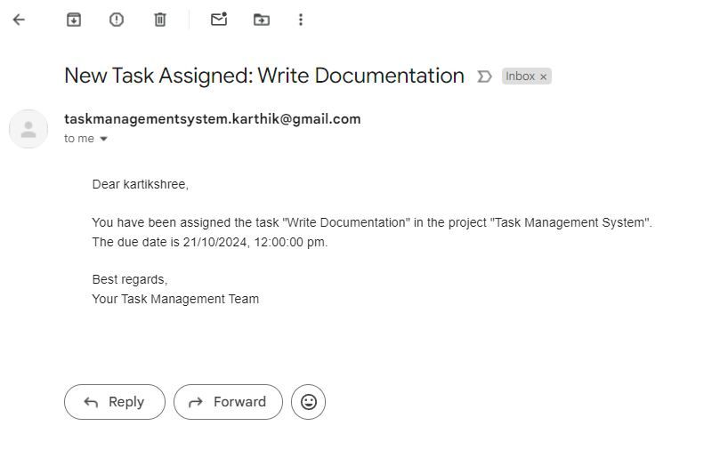

# Task Management System

## Table of Contents

- [Task Management System](#task-management-system)
  - [Table of Contents](#table-of-contents)
  - [Introduction](#introduction)
  - [Requirements](#requirements)
  - [Installation](#installation)
  - [Configuration](#configuration)
  - [Start the application](#start-the-application)
  - [Application Overview](#application-overview)

## Introduction

This application is a Task Management System that allows OWNER user to create, assign, and manage tasks within projects. Notifications are sent via email when tasks are assigned to a contributor.

## Requirements

- Node.js (v14 or later)
- PostgreSQL (v12 or later)
- npm (Node Package Manager)

## Installation

1. **Clone the repository**
   ```bash
   git clone https://github.com/karthikmulgundmath/TaskManagementSystem.git
   cd task-management-system
   ```

2.**Install dependencies**
npm install

3. **Set up PostgreSQL**

Create a PostgreSQL database and user.
Run the necessary migrations to set up the database schema.

## Configuration

**Environment Variables**
Create a .env file in the root directory of your project and add the following variables:
POSTGRES_USER
POSTGRES_HOST
POSTGRES_DB
POSTGRES_PASSWORD
POSTGRES_PORT
PORT
JWT_SECRET
PROJECT_ID
TOPIC_NAME
SUBSCRIPTION_NAME
GOOGLE_APPLICATION_CREDENTIALS
NODE_MAILER_EMAIL
NODE_MAILER_PASSWORD

## Start the application

npm run start

## Application Overview

This application allows users to manage projects and tasks effectively through a RESTful API. Users are categorized into two types: Owners and Contributors.

User Roles
Owner:

Can create, retrieve, update, and delete projects.
Can create, retrieve, update, and delete tasks.
Can create, retrieve, update, and delete comments on tasks.
Contributor:

Can retrieve projects.
Can retrieve and update tasks.
Can create, retrieve, update, and delete comments on tasks.
Logging and Notifications
All task updates are logged in the task_logs table.
Notifications are saved in the notification table.
Notifications are sent via Nodemailer when a task is created and assigned, utilizing Google Cloud Pub/Sub for message handling.---->
